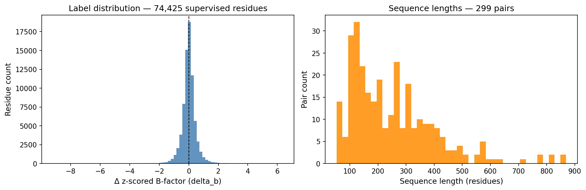
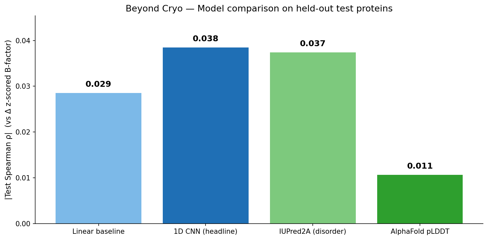
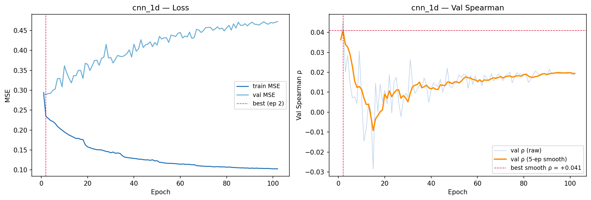
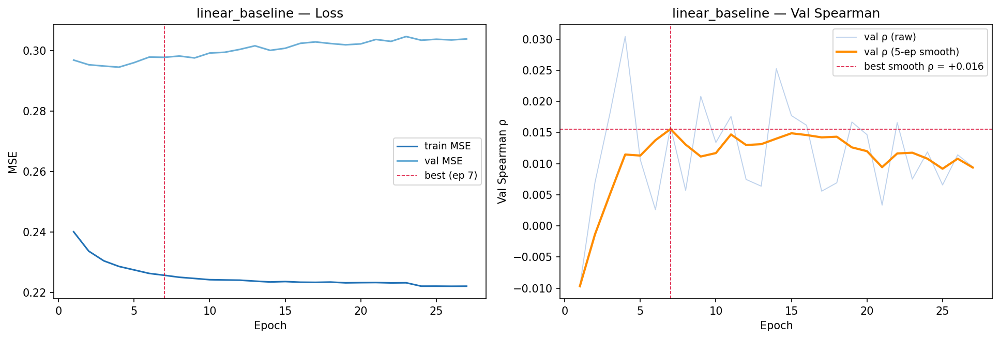
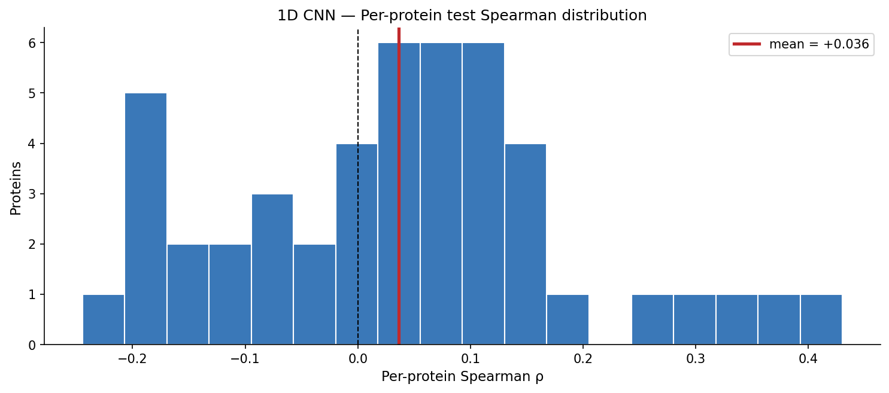
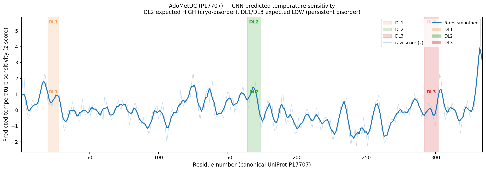

# Beyond Cryo: Predicting Temperature-Sensitive Residues from Sequence

Final project for **Deep Learning in Genomics** (Spring 2026). The goal is to predict, from sequence alone, which residues in a protein become disordered at cryogenic temperature but remain ordered closer to physiological temperature — the kind of localized "freezing artifact" that motivates multi-temperature X-ray crystallography.

The continuous label is `Δ(z-scored B-factor)` between matched cryo (≤150 K) and ambient (≥250 K) X-ray structures of the same protein in the PDB. Per-residue scores from a frozen ESM-2 + trained 1D CNN head are compared against two sequence-based baselines (IUPred2A, AlphaFold pLDDT) on held-out proteins, and demonstrated on a held-out biological case study (human AdoMetDC, [PDBs 9P1H / 9P7Q / 9PBB](https://www.mdpi.com/2218-273X/15/9/1274)).

---

## Pipeline overview

| Stage | Notebook | What it produces |
|---|---|---|
| Mining | `01_mine_pdb_pairs.ipynb` | RCSB Search + GraphQL pull, cryo/ambient pair matching by UniProt + space group + ≤5% cell deviation; mmCIF download; per-residue B-factor z-scoring → `data/manifest.csv` (1,162 raw pairs), `data/labels/*.npz`, `data/sequences/*.fasta` |
| QC | `02_dataset_qc_and_filtering.ipynb` | Resolution-diff, residue-overlap, AA-disagreement, ambient-temp, seq-length filters; 3-mer Jaccard sequence clusters; 70/15/15 cluster-aware split → 838 pairs |
| Strict QC | `03_dataset_strict_qc.ipynb` | Ligand-state retrofit via GraphQL nonpolymer fetch + buffer/cryoprotectant denylist; MMseqs2 attempt (Windows binary failed → k=4 Jaccard t=0.10 fallback, disclosed in Methods); re-split → `manifest_v3.csv` (838 full) and `manifest_v3_strict.csv` (299 ligand-matched) |
| Embeddings | `04_esm2_embeddings.ipynb` | `facebook/esm2_t33_650M_UR50D` frozen, 1280-dim per-residue embeddings cached to `data/embeddings/{uniprot}.npy`; sliding-window strategy for sequences > 1022 residues |
| Training | `05_train_cnn_head.ipynb` | Linear baseline + 1D CNN head (kernels 5/7/9, 336k params); IUPred2A + AlphaFold pLDDT benchmarks; AdoMetDC case study |

**Held-out protein:** human AdoMetDC (UniProt P17707) is excluded from every split throughout the pipeline. It is the independent biological test case in the final evaluation — DL1 (residues 20–28) and DL3 (292–302) are persistently disordered (should score low); DL2 (164–174) is disordered at 100 K but ordered at 273/293 K (should score high).

## Dataset state

After QC the strict (publication-grade) dataset has **299 pairs**, split 208 / 44 / 47 across train / val / test by sequence cluster. The continuous label is small but non-trivial — `Δ z-scored B-factor` has mean ≈ 0, σ ≈ 0.49, |q95| ≈ 0.98, so **Spearman ρ** is the headline metric, not RMSE.



## Results — sequence-only models on held-out proteins

The 1D CNN edges out the linear baseline and matches IUPred2A on test Spearman; AlphaFold pLDDT shows essentially no signal in this direction (as expected — pLDDT measures ordered confidence, not differential temperature sensitivity).



| Model | Val Spearman ρ | Test Spearman ρ | Test Pearson r | Test RMSE | Notes |
|---|---:|---:|---:|---:|---|
| Linear baseline | +0.0156 | +0.0285 | +0.0186 | 0.4950 | Linear(1280→1) |
| **1D CNN (headline)** | **+0.0409** | **+0.0385** | **+0.0294** | **0.4889** | k=(5,7,9), h=64 |
| IUPred2A (disorder) | — | +0.0374 | — | — | sequence-based disorder score |
| AlphaFold pLDDT | — | −0.0107 | — | — | high pLDDT = ordered (negative ρ expected) |

### Training curves

The CNN overfits early — best val Spearman is reached at epoch 2 and the smoothed curve drifts downward as train MSE keeps falling. Early stopping on smoothed val ρ keeps the headline checkpoint.



The linear baseline plateaus quickly with a much narrower train/val MSE gap — its best smoothed val ρ is +0.016 at epoch 7.



### Per-protein consistency

The pooled Spearman is a per-residue summary across all test proteins. Per-protein ρ is a noisier picture: **30 of 47** proteins have positive ρ, but the distribution is wide (σ ≈ 0.15) with a small minority of strongly negative outliers. The model is consistently useful in aggregate but not protein-uniform — consistent with the limited size of the strict training set and the small Δ-B effect.



### AdoMetDC case study

Inference on the held-out P17707 sequence with the trained CNN, with the three disordered loops shaded:



- **DL2 (164–174):** mean predicted z ≈ +0.69 — **correctly elevated** (the cryo-only-disordered loop).
- **DL3 (292–302):** mean predicted z ≈ near zero / slightly negative — **correctly low**.
- **DL1 (20–28):** mean predicted z ≈ +0.70 — **higher than expected** (DL1 is persistently disordered in our structures, so should be low). This is the most informative miss: the model appears to flag the N-terminal region broadly rather than discriminating between persistent vs cryo-only disorder.

## Reproducibility

All notebooks expect a `data/` directory at the project root and write into it. To rebuild from scratch:

```bash
# 1. Mine PDB pairs (downloads ~ a few GB of mmCIF; cached aggressively)
jupyter nbconvert --to notebook --execute 01_mine_pdb_pairs.ipynb
# 2. Jenitha's first-pass QC
jupyter nbconvert --to notebook --execute 02_dataset_qc_and_filtering.ipynb
# 3. Strict QC + ligand state + re-split
jupyter nbconvert --to notebook --execute 03_dataset_strict_qc.ipynb
# 4. ESM-2 frozen embeddings (Colab + GPU recommended — ~2.5 GB model download)
jupyter nbconvert --to notebook --execute 04_esm2_embeddings.ipynb
# 5. Train + benchmark + AdoMetDC inference
jupyter nbconvert --to notebook --execute 05_train_cnn_head.ipynb
```

Notebooks 04 and 05 are designed to run on Colab (the first cell mounts Drive); on a local GPU machine, edit the first config cell to point `DATA_DIR` at your local `data/`.

### Dependencies

```
python ≥ 3.10
numpy, pandas, scipy, matplotlib, tqdm, requests
gemmi                 # mmCIF parsing (notebook 01)
torch ≥ 2.0           # PyTorch
transformers          # facebook/esm2_t33_650M_UR50D
```

### Repo layout

```
.
├── 01_mine_pdb_pairs.ipynb
├── 02_dataset_qc_and_filtering.ipynb
├── 03_dataset_strict_qc.ipynb
├── 04_esm2_embeddings.ipynb
├── 05_train_cnn_head.ipynb
├── deep_learning_project_plan.md
├── results/
│   ├── label_distribution.png
│   ├── training_linear_baseline.png
│   ├── training_cnn_1d.png
│   ├── comparison_bar.png
│   ├── per_protein_spearman.png
│   ├── adometdc_case_study.png
│   ├── comparison_table.csv
│   ├── per_protein_spearman.csv
│   ├── iupred2a_test.csv
│   └── alphafold_plddt_test.csv
└── data/                # generated by notebooks (gitignored)
```

## Caveats and disclosures

- **MMseqs2 fallback.** MMseqs2 `easy-cluster` exited non-zero on the Windows binary used during development; notebook 03 falls back to k=4 Jaccard clustering at threshold 0.10. The fallback is disclosed in the Methods. Re-running under WSL2 with a working MMseqs2 install is the preferred path for a polished writeup.
- **Effect size is small.** Δ-B between matched cryo/ambient pairs is a noisy continuous label; the strict-QC dataset is only 299 pairs. Test Spearman ρ ≈ 0.04 is statistically real but practically modest, and the CNN is essentially tied with IUPred2A. The dataset is the more important contribution here than the model.
- **Class imbalance for "cryo-only-disordered" residues.** ~1,400 ambient-only-modeled residues across the dataset are the DL2-style cases. Binary framing would be heavily imbalanced; the continuous Δ-B framing was chosen instead.
- **B-factors are z-scored within each structure** before differencing. Absolute B-factor magnitudes are not comparable across crystals because of refinement-scale differences.

